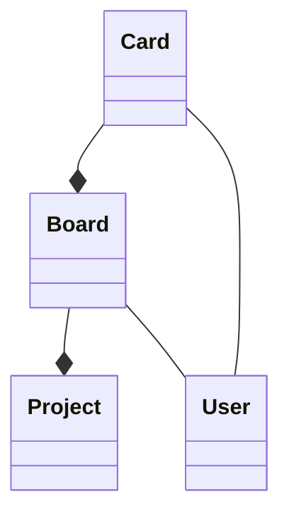

# TP 2-5: JPA et JaxRS + openAPI

**Projet de Théo Denes et Jean Lagniaux**

Pour lancer et tester le projet : 
 1. Importer le projet dans votre IDE
 2. Créer et utiliser une **base de données** :
	- Soit prendre le script SQL **"sir_database.sql"**
	- Autrement créer une base de données sur un serveur local et mettre à jour le fichier **"persistence.xml"** avec vos credential. 
 3. Pour **lancer le projet** : 
	 - Run le **"Pom.xml"** en tant que maven build >>> ${project_loc:jaxrs-example} ) 
	 - Si vous avez créés votre base de données sans prendre le fichier SQL ou pour tester les classes de **DAO**, vous pouvez décommenter la fonction **Main** dans le fichier **"JpaTest"** et le run en tant que application Java afin de peupler la base de données et d'utiliser les classes de DAO
 4.  Pour utiliser l'**API** :
	 - Lancer le fichier **"RestServer"**
	 - Consulter les différentes méthodes disponibles sur http://localhost:8080/openapi.json
		 - *A savoir : le projet évolue et peut donc changer en fonction du temps où il est testé, pour être certain du fonctionnement de l'api, prenez la liste ci-dessous ou utilisez la librairie postman à la racine du projet*
	 - tester les différents endpoint. 

## API

|Méthodes  | how to|  endpoint|
|--|--|--|
|GET card by ID  |  localhost:8080/card/{id} | http://localhost:8080/card/8
|GET board by ID | localhost:8080/board/{id} | http://localhost:8080/board/7
|GET user by ID (mail)  |  localhost:8080/user/{mail}|http://localhost:8080/user/theo@mail.com
|POST add user |  **param en JSON** dans le body {"CardName"  :  "finir le projet","CardNote"  :  "rendre le projet fini","CardTODO"  :  5,"CardStatus"  :  "DOING"}|http://localhost:8080/card/addCard
|POST add card  | **param en JSON** dans le body {"mail"  :  "Hua@mail.com","name"  :  "hua"}|http://localhost:8080/user/addUser
 
## Structure du projet

